# Commercial Banking Front Office: new approach to serve customers
## Thesis defense
<!--
### the technics you apply in frame of collecting the answers of survey (methodology, how the respondents were selected for the survey, and so on)
### VERY IMPORTANT: second reviewer (recenzja)comments and objections – you have to know the answer and you explanation. In most cases the questions are same as those objections.
-->

---

### Thesis. Reasoning

- Online banking is extremelly comfortable
- However, current forms of interaction are not ideal
- Customer service centers are a bottleneck
- Dialog forms of interaction
<!--
Nowadays, it is practically impossible to imagine life without online banking, which is extremely comfortable for the clients because of its simplicity and speed of provided services. 

However, current forms of user interaction are not ideal, as those expect advanced knowledge about application structure and its possibilities.

On the other hand, high accessibility of communication with customer support created a bottleneck, which cannot help clients properly and in reasonable time.

Current achievements of Computers Science and Statistics, theoretically, allow creation of new forms of user interaction, based on clients' needs, and not application functionality.

Those forms would look like a dialog window in a common messenger or a speaking chatbot.

Such solutions do already exist.
Though, those are based on predefined rules and not on natural languages.

Both tasks of understanding and generation of natural languages are exceptionally costly and complicated.
Nevertheless, modern science have already reached milestone when it is achievable and is possible to be considered as a business solution.

As an additional fact, general trend on banks' openness towards third-party software developers and corresponding requirements by authorities create certain playground, allowing to delegate such risky intentions to third-parties, start-ups.
-->

---

### Thesis. Structure
- Banking system overview
- Digital Banking
- Open Banking and PSD2
- Artificial Intelligence in banking
- Conversational Banking
- Chatbots as a new approach to serve customers
- Strategy of a chatbot solution
- Research

<!--

Research in a form of a survey
-->

---

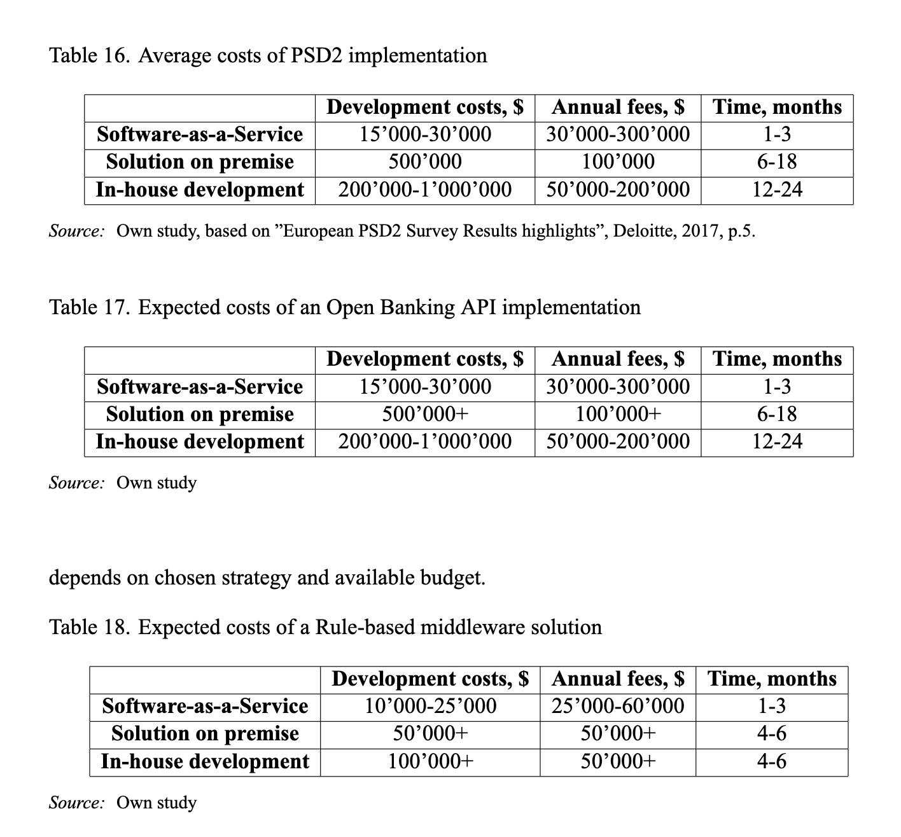
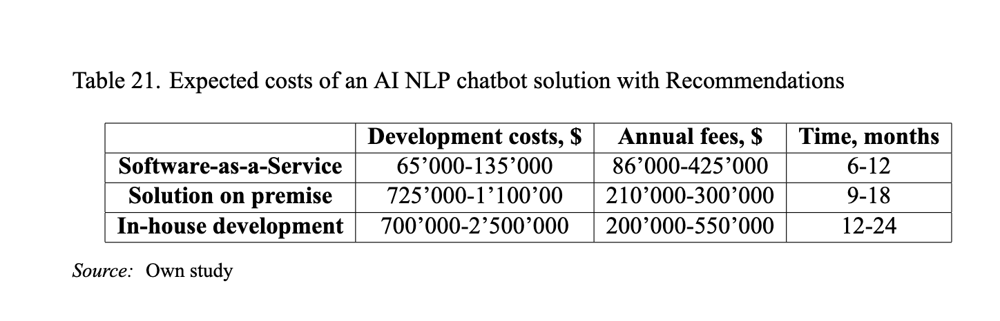

<!--
- Table 16 as an example
- Table 17 + Table 18 as cheap solution
- Table 21 as target solution
-->

---

### Survey. Reasoning

- ML&AI require a lot of time and resources to develop
- The main hypothesis is: Commercial Banking clients are ready for Automated Front Offices in a form of a chatbot.
- The survey was conducted in order to determine current level of satisfaction with front-office. 

<!--As it was previously analyzed, chatbot solution may require both a lot of time and a lot of resources to develop.
Intuitively, we may expect mentioned ML&AI-based chatbots to be an ideal, automated solution for cost decrease and effective customer support.
Unfortunately, banking clients may have subjectively negative opinion on existing rule-based chatbots, which are usually considered as an avant-garde of customer support, but may not help properly client needs.

Therefore, survey was conducted in order to determine current level of satisfaction with front-office.

To proof this thesis the descriptive method and survey will be used.
The survey was conducted in order to determine current level of satisfaction with front-office. 

-->

---

### Survey. Methodology

- Google Forms
- Distributed over personal finance dedicated chat-rooms
- Distributed directly to interested people
- 278 respondents

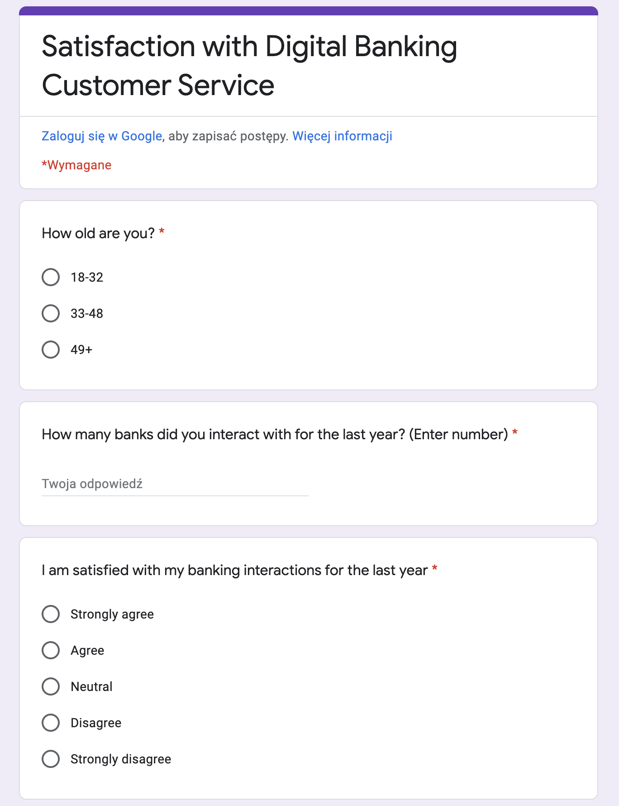

<!--
Respondent's portrait was an active internet banking services user, with a high level of requirements and confidence.
Therefore, I've decided to complete a survey over various finance-dedicated chat-rooms, which assumes from people to have a certain level of financial literacy.
Google Forms was chosen as the most common, both for researchers and respondents.
Answers were exported to CSV, processed and later used in a Python script for plot generation.

In entire survey 278 respondents were involved. 
-->

---

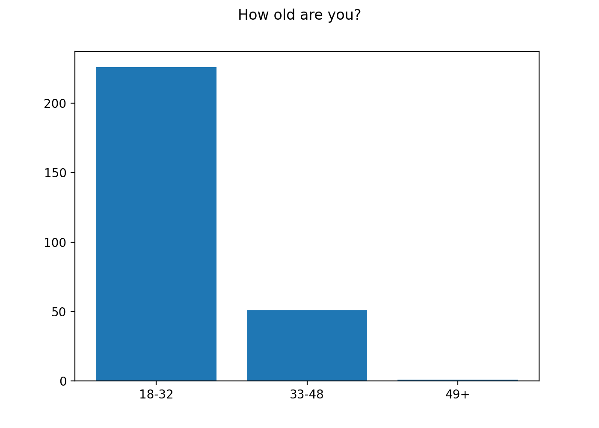

<!--
First question was to build an age portrait. 
Age answers were divided in three categories based on generation experience with dialog interfaces.
First group lower limit of 18 years was chosen due to socially acceptable age of responsibility.
First group upper limit of 32 years was chosen as dialog interfaces became most viable nearly 15 years ago, resulting in experienced users of dialog interfaces.
Second group upper limit was chosen based on a socially acceptable middle-age medium. 
It is possible to observe dominance of young generation among respondents.
-->

---

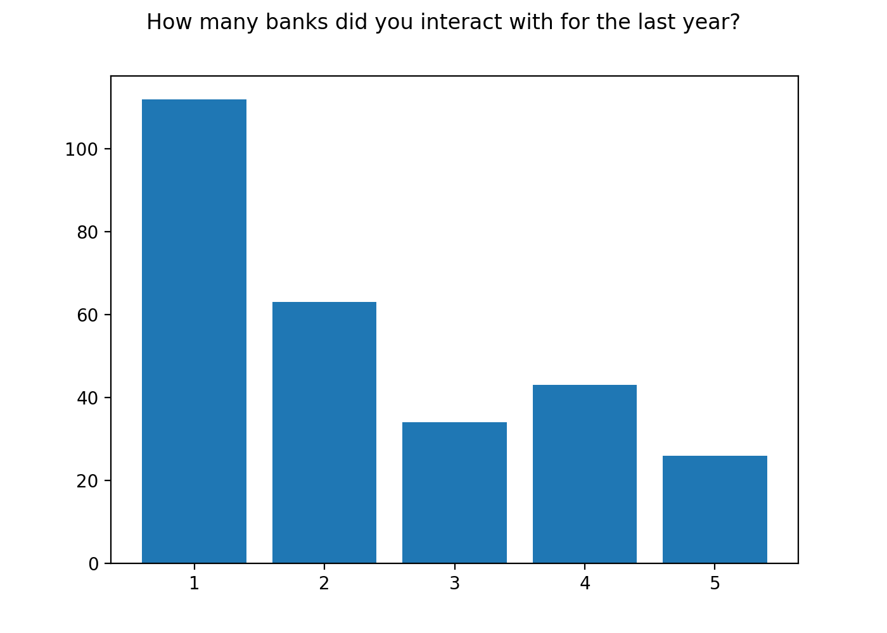

<!--
On the other hand, second question had shown high levels experience of banking interactions among respondents, as more than a half of respondents used services of 2 or more banks for the last year.
-->

---

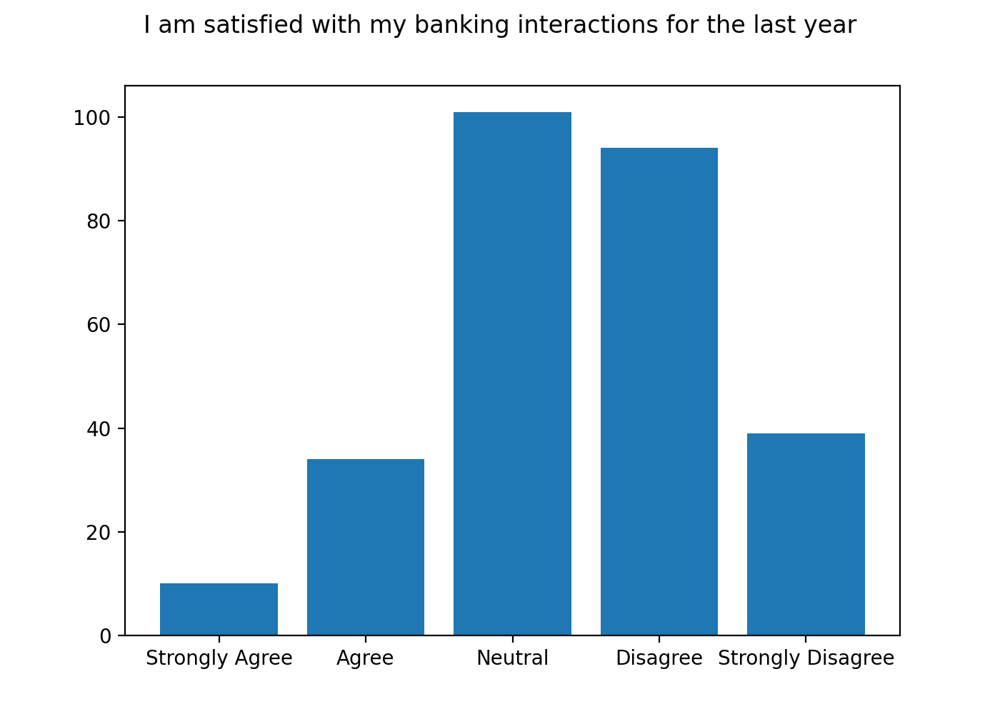

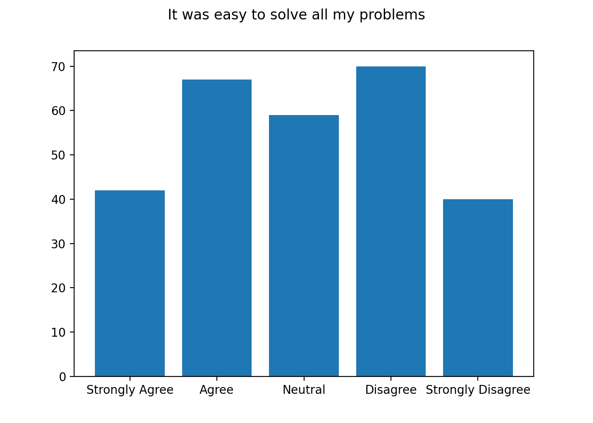

<!--
However, next two questions, question about satisfaction with banking interactions and question about satisfaction with problem-solving, had shown slightly negative feeling towards existing customer support systems.
-->

---

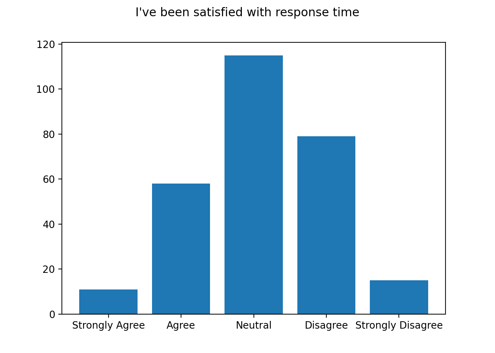

<!--
At the same time, even though most of the researches had shown general dissatisfaction with response times, respondents of this survey were more loyal and showed neutrality.
-->

---

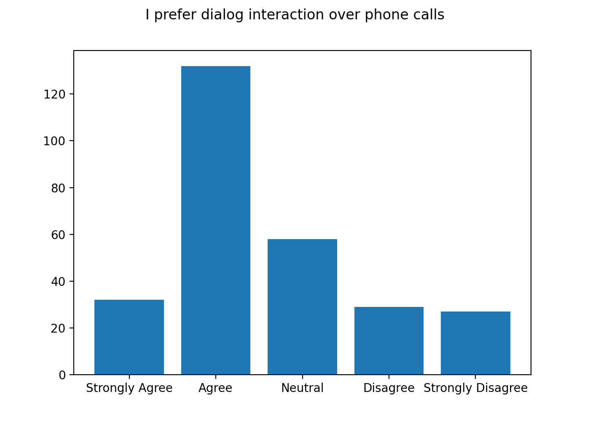

<!--
Next question confirmed hypothesis about survey population and showed that respondents mostly prefer dialog interactions over phone calls.
-->

---

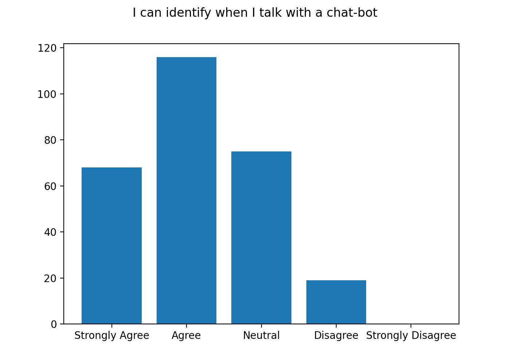

<!--
One of the most interesting results is high assurance of respondents that they know when they walk with a chatbot, and not a human employee.
-->
---

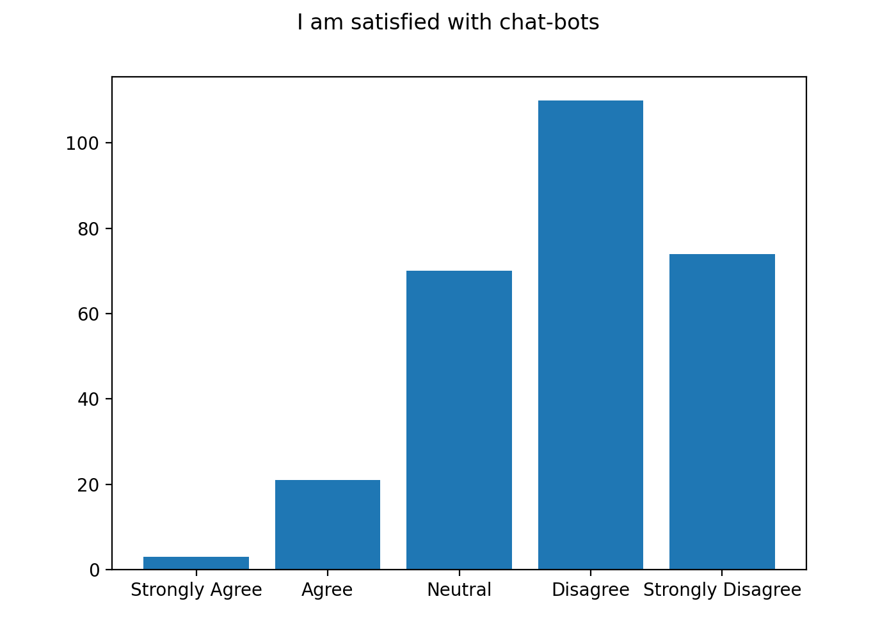

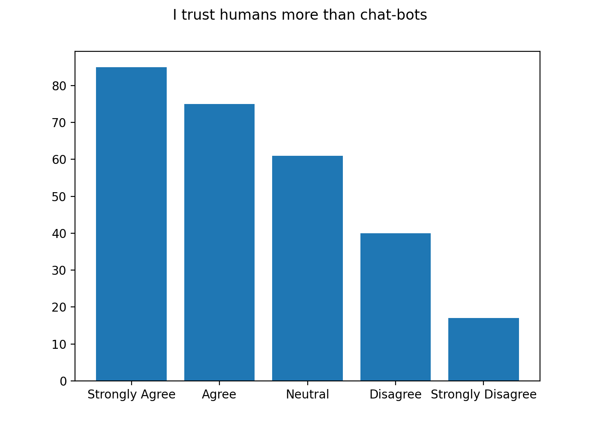

<!--
However, I suspect this is connected to significant dissatisfaction with chatbots, as there is a perfect negative correlation between questions about chatbot awareness and satisfaction with chatbots.
Additionally, we can observe higher trust to human employees over automated solutions.
-->

---

### Survey. Results

- People between 18 and 32 years old prefer dialog interfaces over vocal communication
- Clients will prefer dialog forms over other forms
- Clients are used to long response time
- Clients tend to trust people more
- High dissatisfaction with existing chatbots' effectiveness
- Strong client association that chatbots are bad and ineffective
- Minor satisfaction with existing form of user interaction
- Negative expectations about automated solutions

<!--
As a result, survey showed a lot of interesting points and formed multiple conclusions.
In general, survey showed that people between 18 and 32 years old prefer dialog interfaces over vocal communication.

Moreover, clients will prefer dialog forms over other forms even though those are not as effective as clients expect and may result in slightly negative experience for client.

On the opposite, common argument of long response time may be outdated, as even more demanding generation of clients are neutral.

Although, dialog is preferred, clients tend to trust people more.
In my opinion, this opinion is very subjective, as automated solutions may advise more exactly and don't require prior experience.
Probably, this is connected to high dissatisfaction with existing chatbots' effectiveness.

Moreover, negative impact of chatbots forced clients to learn to determine when they talk to a chatbot and when to an employee.
This results in a strong client association that chatbots are bad and ineffective.

Consequently, next generation of chatbots have to speak to clients in a natural language, in order to be indistinguishable from employee.
Thus, Artificial Intelligence technologies, including Machine Learning and Natural Language Programming are highly required.

Nevertheless, we can observe general minor satisfaction with existing form of user interaction and negative expectations about automated solutions.

-->

---

### Survey. Conclusions

- Clients are not ready for chatbots yet.
- Hypothesis has to be rejected.
- Hybrid approach should be considered.

<!--
This shows that clients are not ready for chatbots yet.
Moreover, it is possible to conclude that chatbots are not that much for consumers, as they are an important evolution milestone for the banks.
Even if there would be a chatbot solution which passes some limited version of Turing test, when the customer finds
out that all that he was talking to a chatbot, he may feel deceived and lose trust to a bank.

The main hypothesis of this thesis was that Commercial Banking clients are ready for Automated Front Offices in a form of a chatbot.
Conclusively, this hypothesis has to be rejected.
People are not ready and have negative subjective feelings towards chatbots.
Changing those feelings would require significant marketing costs.

However, the most valid injection of a chatbot solution would be in a hybrid approach.
Hybrid approach is a synergy between human employee and an automated chatbot system.
In hybrid approach robot recommends an answer to an operator based on existing knowledge base.
In this case, customer trusts and employee, but receives exact fast answer from an internal chatbot system.
-->
